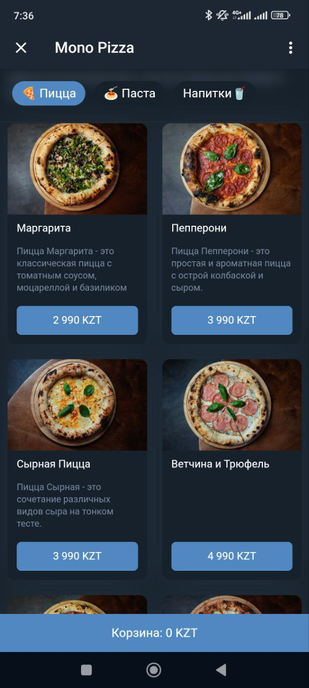
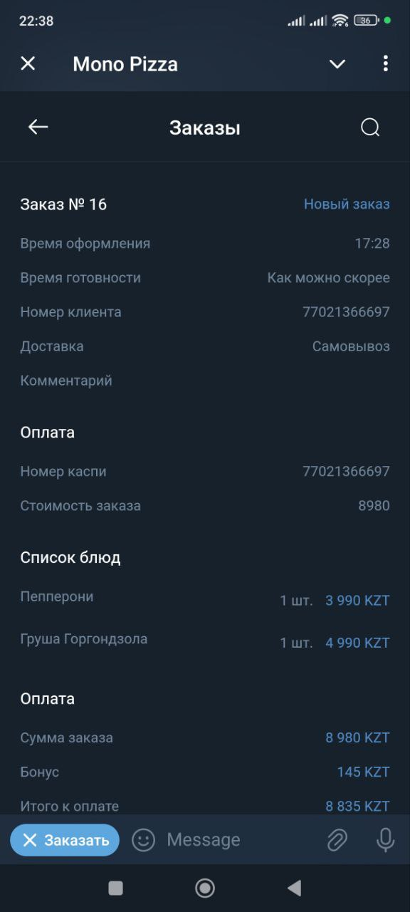
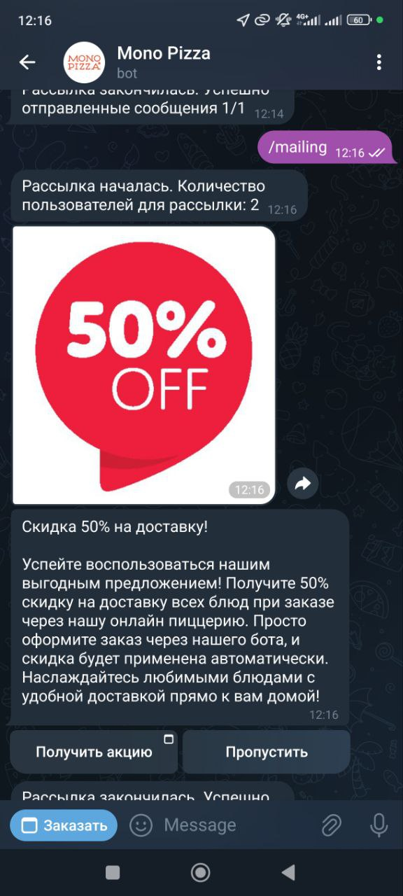

<p align="center">
  
</p>

# RESTOLAND — Веб-приложение для Telegram-бота ресторана


**RESTOLAND Web** — это фронтенд-панель для Telegram-бота ресторана. Она предоставляет административный интерфейс для управления заказами, акциями, аналитикой и взаимодействием с клиентами в удобной и понятной форме.

## Основные возможности
- 📦 **Управление заказами** с обновлением статуса в реальном времени
- 📊 **Аналитика заказов** и отслеживание поведения клиентов
- 🎁 **Система лояльности** и настройка акционных кампаний
- ✉️ **Создание рассылок** с гибким таргетингом
- 🗺️ **Интеграция с Яндекс Картами** для адресов доставки и самовывоза
- ⚙️ **Админ-панель** для настройки меню, цен и параметров системы

## Стек технологий
- **React 18** — интерфейс SPA
- **Redux Toolkit + Redux Persist** — управление состоянием и сохранение данных
- **MUI (Material UI)** — готовые компоненты интерфейса
- **Tailwind CSS** — утилитарная стилизация
- **Vite** — быстрый сборщик и dev-сервер
- **Яндекс Карты** — геолокация и карта
- **Day.js** — работа с датами
- **String Similarity + Levenshtein** — нечеткий поиск по товарам и адресам

## Как начать работу

1. Клонируйте репозиторий:
   ```bash
   git clone https://github.com/NurzhanTng/foodsite_front.git
   ```

2. Установите зависимости:
   ```bash
   npm install
   ```

3. Запустите dev-сервер:
   ```bash
   npm run dev
   ```

4. Откройте в браузере:
   ```
   http://localhost:5173
   ```

## Скриншоты

<p align="center">
  
</p>
<p align="center"><i>Навигация по меню</i></p>

<p align="center">
  
</p>
<p align="center"><i>Статусы заказов в реальном времени</i></p>

<p align="center">
  
</p>
<p align="center"><i>Акции и предложения по лояльности</i></p>

## Связанные проекты

- [Клиент (Telegram-бот)](https://github.com/NurzhanTng/foodsite_bot)
- [English README.md](./README.md)

---

**RESTOLAND Web** — часть экосистемы RESTOLAND для автоматизации ресторанов. Если вы нашли ошибку или хотите внести улучшения — не стесняйтесь создать issue или pull request.
